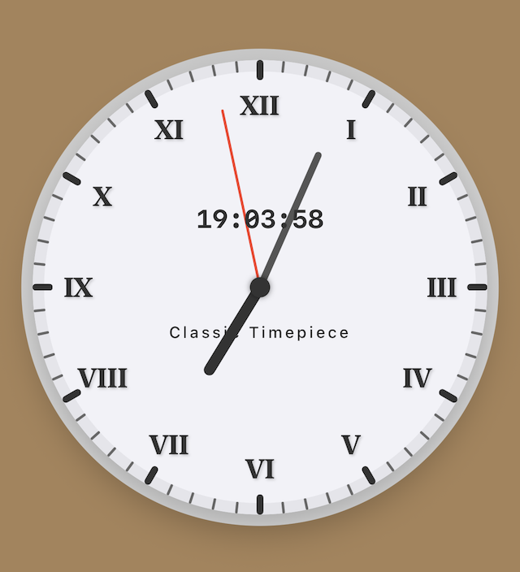

# RomanClock - 罗马时钟 🕰️

一个优雅的 SwiftUI 罗马数字时钟应用，结合了经典罗马数字表盘和现代数字时间显示。

## 功能特点

- 🎨 精美的罗马数字表盘设计
- ⏰ 实时显示时、分、秒指针
- 🔢 数字时间显示（HH:mm:ss 格式）
- 📱 响应式设计，适配不同设备尺寸
- 🎯 流畅的指针动画效果

## 屏幕截图

## 支持

如果你喜欢这个项目，请给它一个 ⭐️！

如有问题或建议，请创建 [Issue](https://github.com/swiftuihome/RomanClock/issues)。
